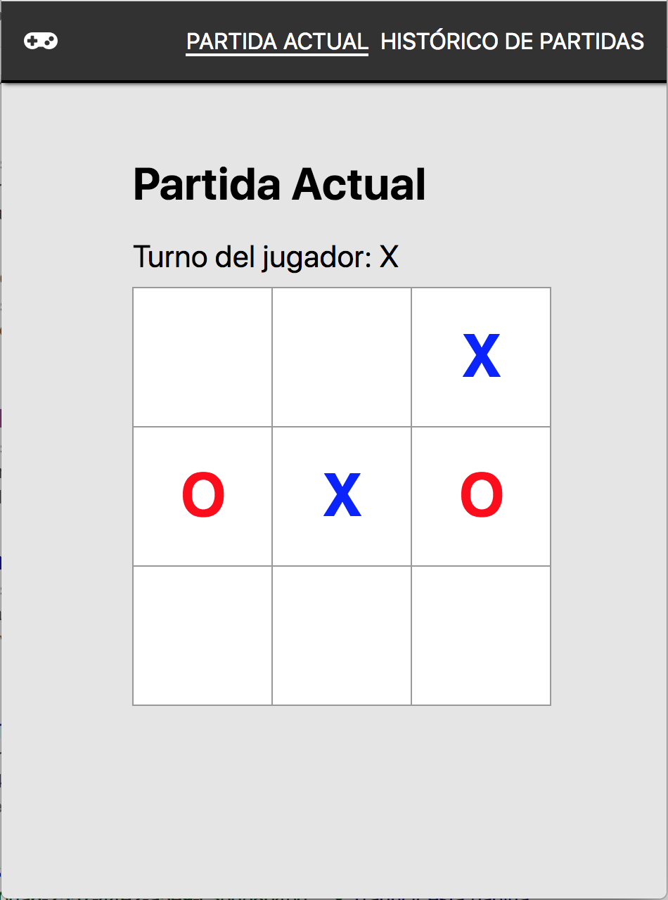
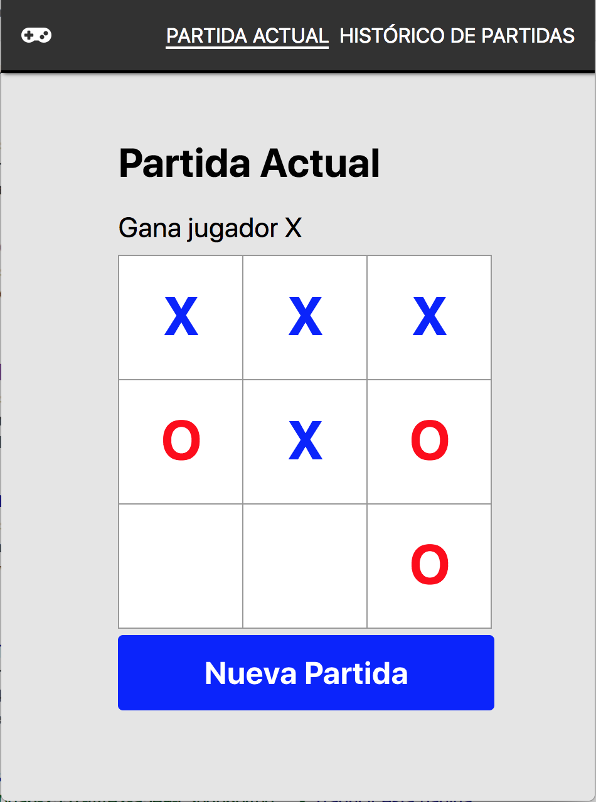
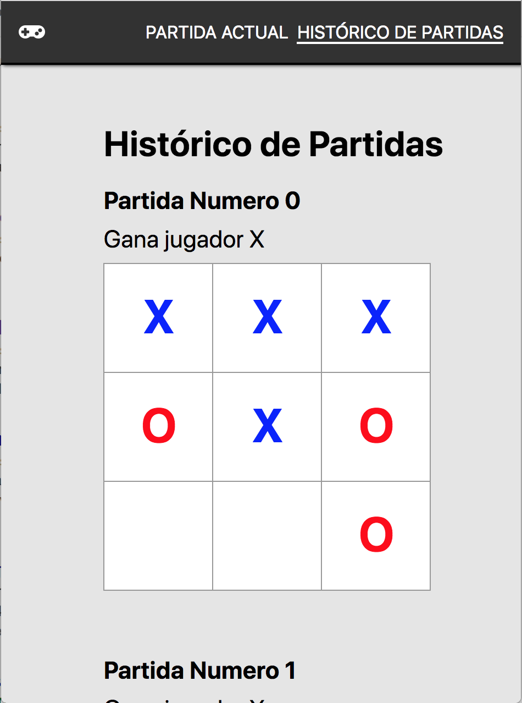

# 3 En Raya 

Juego "3 En Raya" desarrollado en ReactJS como práctica del módulo React del VI Bootcamp de Desarrollo Mobile de Keepcoding.

 Jugando                  |  Declarando Vencedor         |  Histórico de Partidas                
:------------------------:|:----------------------------:|:------------------------------:
  |  | 

## Características Funcionales ✨

- El estado de la partida actual es persistido en la memoria Local. Es posible continuar la partida en cualquier momento aunque se cierre el navegador
- Se almacena un historial de todas las partidas jugadas. Desde la ruta del "Histórico de Patidas" puede consultarse un listado de todas las partidas jugadas con el resultado (Empate o Jugador ganador) así como el estado final del tablero al terminar la partida.
- Cuando se produce el fin del juego, es posible iniciar una nueva partida pulsando el botón que aparecerá.

## Características Técnicas 📝

- Desarrollado en ReactJS.
- Persistencia local mediante Redux.
- Uso de styled-components para aplicar estilo a los elementos.
- Uso de React-Router para el maneto de rutas.
- Uso de elementos de la librería Rebass.

## Instrucciones

- Instalar dependencias: `yarn install` 
- Iniciar aplicación: `yarn start` 